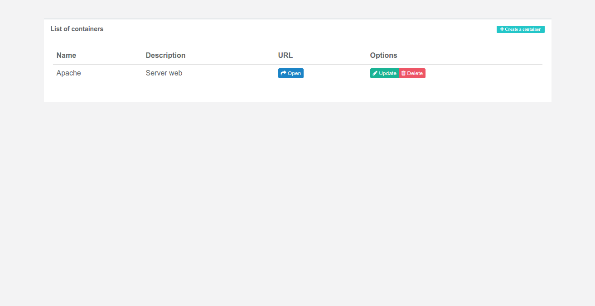

# Containers-Repository

List of containers running in your machine

# Technology
 - Server:

Spring Boot  
Spring Web  
Jersey  
PostgreSQL  
Spring Data/JPA  

  - Client:

AngularJS  
NodeJS  
ExpressJS

# Screenshot

# Deploy
  docker run --net="host" -d -p 9090:9090 --name containers-respository containers-respository

